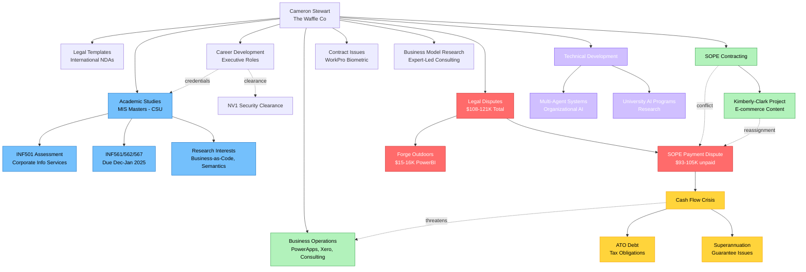
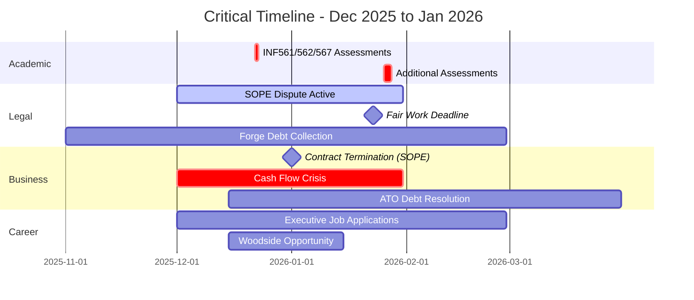
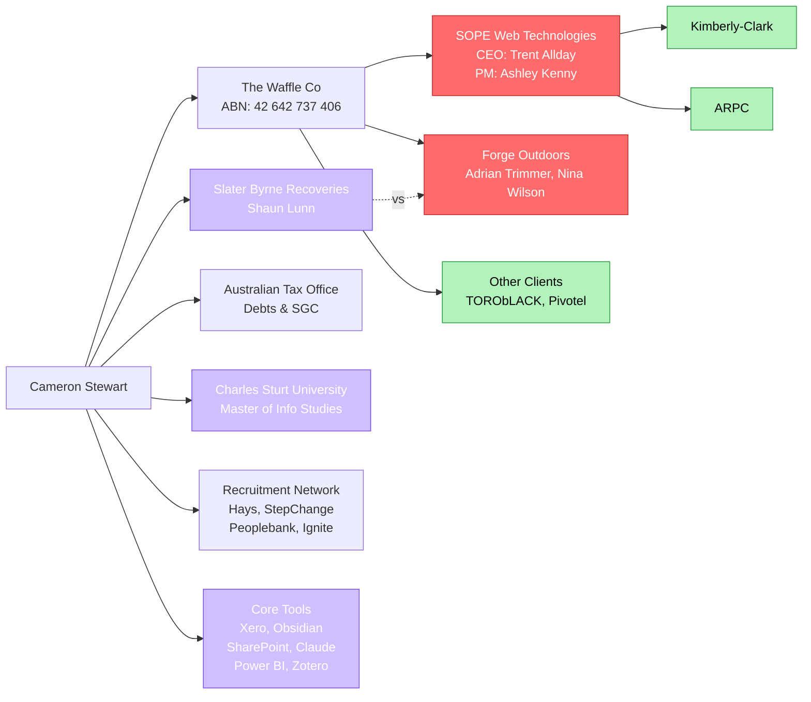
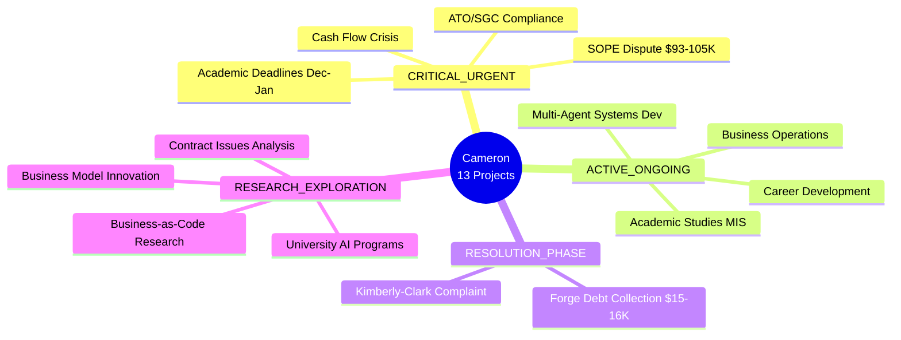
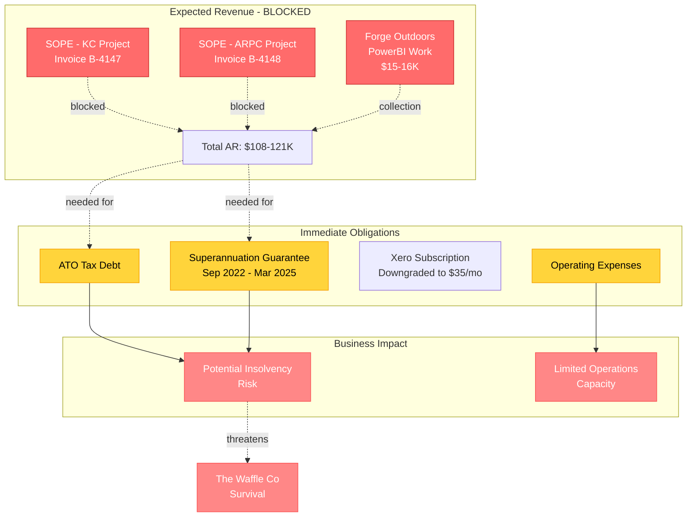

# Project Relationships Diagram

## Primary Network Diagram

## Temporal Relationships

## Stakeholder Network

## Project Categorization by Status

## Financial Flow Diagram

---

## Key Relationship Patterns Identified

### 1. **SOPE Centrality**
- Appears in 4 separate project memories
- Creates direct connection between client work and legal disputes
- Root cause of financial crisis affecting business operations

### 2. **Financial Cascade**
- Unpaid invoices → Cash flow crisis → ATO debt → Potential insolvency
- Multiple feedback loops amplifying financial pressure

### 3. **Academic-Career Integration**
- MIS studies provide credentials for executive roles
- Research interests inform business development
- Time pressure from assessments during critical business period

### 4. **Legal Complexity**
- Two major disputes totaling $108-121K
- Multiple legal mechanisms (debt collection, promissory estoppel, Fair Work)
- Professional relationship damage limiting future opportunities

### 5. **Tool Ecosystem**
- Highly integrated: Xero, Obsidian, SharePoint, Claude form interconnected workflow
- Documentation-heavy approach across all projects
- Systematic evidence preservation for legal matters
