# Woodside Information Management Service - Transcript Analysis

## Executive Summary

This transcript captures an interview for a **SharePoint/Information Management Specialist** role within Woodside's Digital team. The conversation reveals insights into Woodside's centralised information management service, its challenges, team structure, and strategic direction.

---

## 1. Roles Identified

### Internal Roles (Woodside)

| Role | Description | Current Holder |
|------|-------------|----------------|
| **Service Line Owner** | Oversees centralised IM service, governance frameworks | Julie (Interviewer) |
| **Information Management Specialist** | Focus on IM, document control, records management | Belinda |
| **Microsoft 365 Architect** | Technical architecture for M365 environment | Unnamed (on leave in January) |
| **SharePoint Functional Specialist** | Business requirements, site builds, consulting (ROLE BEING RECRUITED) | Outgoing staff member (5 years tenure) |
| **Managed Service Team** | Incidents, generic service requests, access permissions | Bangalore/Hyderabad team |

### External/Candidate Background

| Role Type | Experience Areas |
|-----------|------------------|
| **Consultant** | SharePoint implementations, migrations, governance frameworks |
| **Solution Architect** | DMS builds, classification schemes, metadata standards |
| **Change Manager** | Adoption, training, stakeholder engagement |

---

## 2. Processes Identified

### 2.1 Service Request Workflow

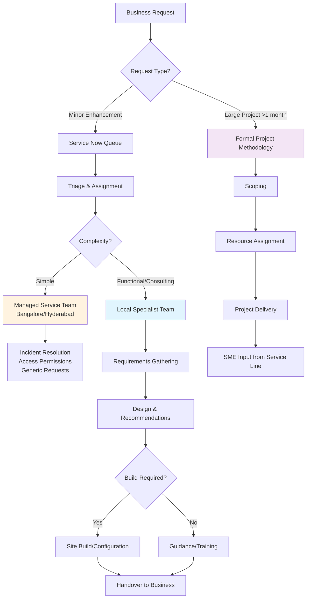

### 2.2 SharePoint Site Provisioning & Enhancement

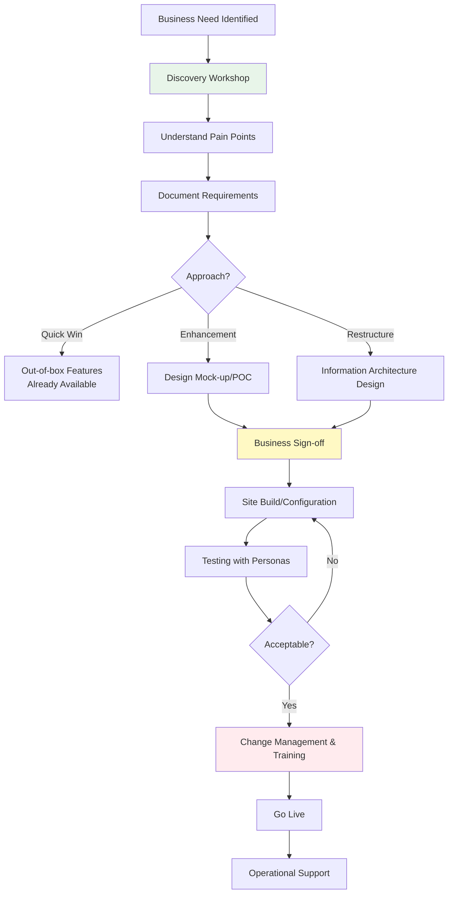

### 2.3 Migration Process

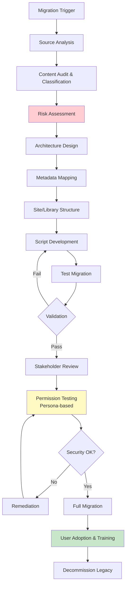

### 2.4 Records Management Lifecycle

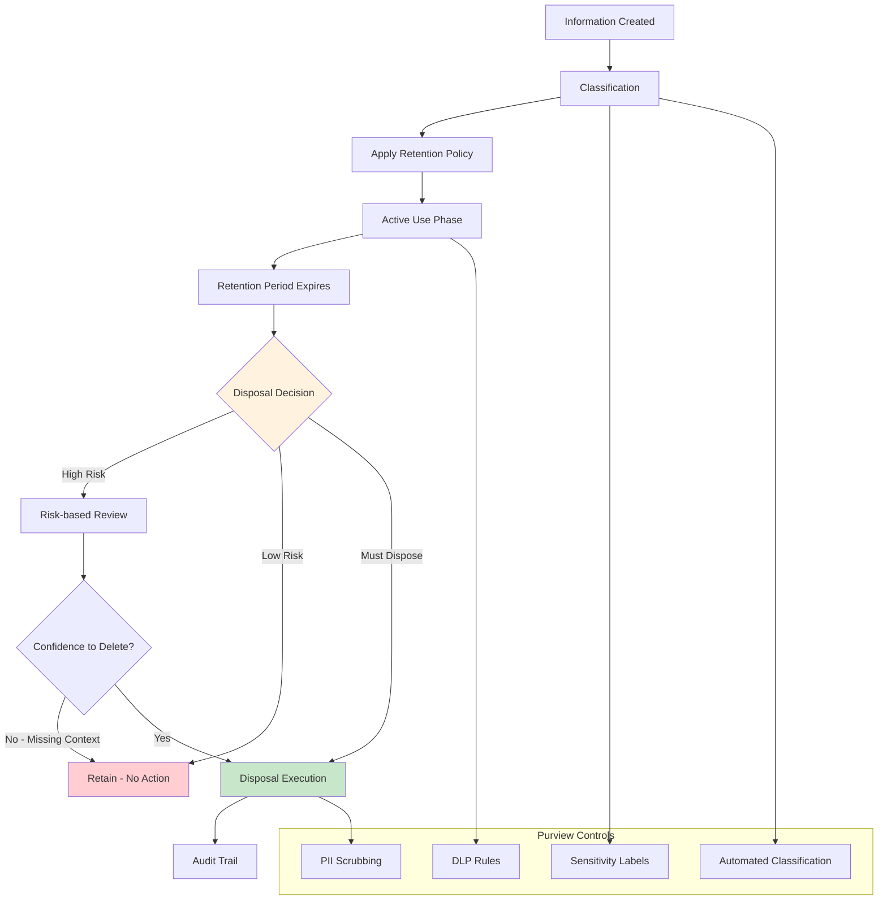

---

## 3. Systems Identified

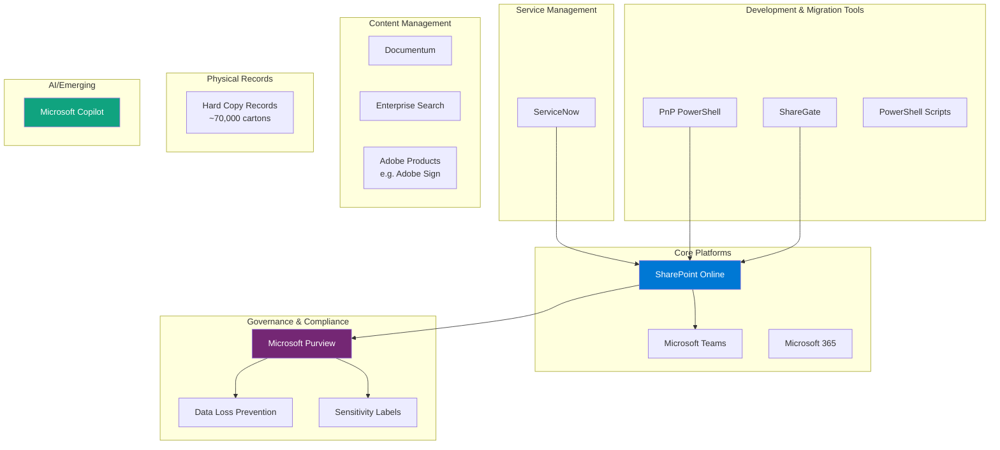

---

## 4. Challenges & Issues

### Strategic Challenges

| Challenge | Description | Impact |
|-----------|-------------|--------|
| **SharePoint Sprawl** | Uncontrolled site/content proliferation due to focus on usability | Findability issues, governance gaps |
| **90 Million Files** | Massive content volume in SharePoint | Storage costs, search performance, AI readiness |
| **AI Readiness** | Copilot adoption requires trusted vs untrusted content differentiation | Risk of AI hallucination on unreliable data |
| **Disposal Paralysis** | People lack context/confidence to make disposal decisions | Endless retention, storage costs |

### Operational Challenges

| Challenge | Description |
|-----------|-------------|
| **Scale vs Control** | Too large to control everything - must prioritise |
| **Legacy Content** | Inherited structures from 7+ year old implementations |
| **Third-party Collaboration** | Project spaces with external parties are complex |
| **Cross-skilling Gaps** | Small team needs coverage across multiple domains |
| **Change Management** | Technology is 20% of solution; 80% is people/process |

### Technical Challenges

| Challenge | Description |
|-----------|-------------|
| **Microsoft Feature Churn** | Constant new features require assessment (help or hinder?) |
| **Teams/SharePoint Confusion** | Historical confusion about where content belongs |
| **Customisation Debt** | Past customisations create upgrade/support issues |
| **Cloud Testing** | "It's live" - no sandbox for Purview/compliance changes |

---

## 5. Information Behaviour & Information Systems (IBIS) Analysis

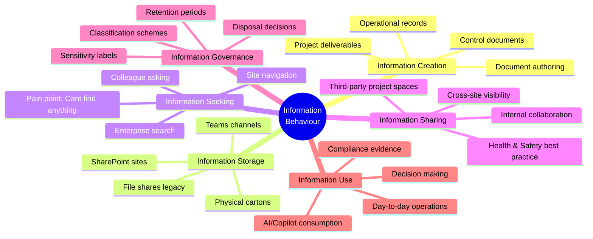

### Key IBIS Observations

1. **Search Behaviour**: Users struggle with findability ("this is a mess, I can't find anything")
2. **Storage Behaviour**: Default to storing everything; disposal avoidance
3. **Classification Behaviour**: Inconsistent metadata application unless mandated
4. **Sharing Behaviour**: Sprawl indicates preference for creating new spaces vs reusing
5. **Trust Behaviour**: Need to differentiate trusted vs untrusted content for AI

---

## 6. Opportunities Identified

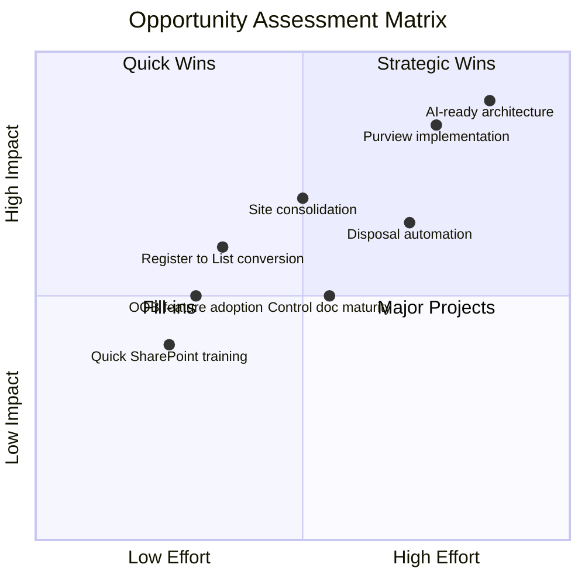

### Detailed Opportunities

| Opportunity | Description | Value |
|-------------|-------------|-------|
| **Purview Records Management** | Embed retention controls across SharePoint | Risk reduction, compliance |
| **AI/Copilot Preparation** | Classify and structure content for AI consumption | Competitive advantage |
| **Site Consolidation** | Address sprawl through IA redesign | Improved findability |
| **Control Document Maturity** | Build on new service, increase adoption | Operational efficiency |
| **Register Conversion** | Transform Word/Excel registers to SharePoint Lists | Audit trails, data integrity |
| **Scan-on-Demand** | Reduce physical records through digitisation | Cost reduction |
| **Self-Service Enablement** | Coach users to manage own sites | Scale support capacity |

---

## 7. Strengths

| Strength | Evidence |
|----------|----------|
| **Established Governance Frameworks** | Documented processes, ITIL, service management standards |
| **Risk-based Approach** | Pragmatic prioritisation - focus on what matters |
| **Strong M365 Adoption** | "Wildly successful" platform rollout |
| **Dedicated Service Line** | Centralised ownership and accountability |
| **Managed Service Partnership** | Bangalore/Hyderabad team handles volume |
| **Outgoing Knowledge Transfer** | Previous role holder available for handover |
| **Executive Support** | AI/Copilot early adopter indicates leadership buy-in |
| **Flexibility Culture** | Work from home options, adaptable to urgent requests |

---

## 8. SWOT Analysis

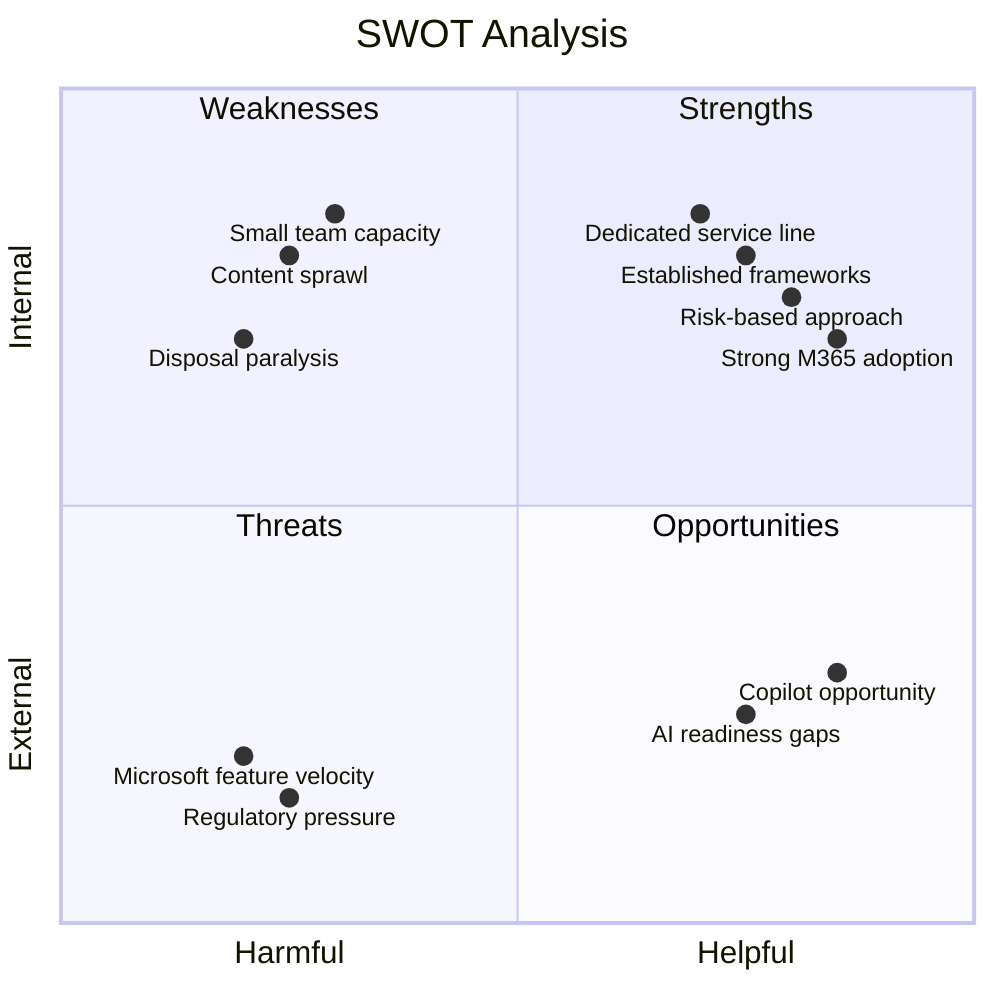

### SWOT Detail

| Category | Items |
|----------|-------|
| **Strengths** | Risk-based governance, Strong M365 adoption, Established service line, Documented standards, Executive support for digital |
| **Weaknesses** | Content sprawl (90M files), Small team capacity, Disposal decision paralysis, Legacy architecture debt, Cross-skilling gaps |
| **Opportunities** | AI/Copilot preparation, Purview records management, Site consolidation, Control document maturity, Physical records digitisation |
| **Threats** | Microsoft feature churn, Regulatory compliance gaps, Storage cost escalation, AI consuming untrustworthy content, Key person dependencies |

---

## 9. Frameworks Mentioned

| Framework | Context |
|-----------|---------|
| **ITIL** | Service management standards referenced |
| **Risk-based Governance** | Core philosophy for prioritisation |
| **Agile** | Mentioned as delivery approach (with flexibility) |
| **Information Architecture** | Site structure, hub design, metadata |
| **Classification Schemes** | Records management, retention mapping |
| **Metadata Standards** | 14 required fields example from candidate |
| **Persona-based Testing** | User acceptance and permission validation |
| **MVP Approach** | Deliver value incrementally, then expand |
| **Change Management** | 80% of solution is people/process |

---

## 10. Team Overview

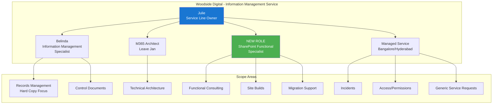

### Team Characteristics

- **Location**: Level 17, Perth office
- **Work Model**: 1 day WFH standard, flexibility available
- **Service Model**: Centralised service ownership
- **Support Model**: Hybrid local expertise + offshore managed service

---

## 11. Key Relationships

### Internal Relationships

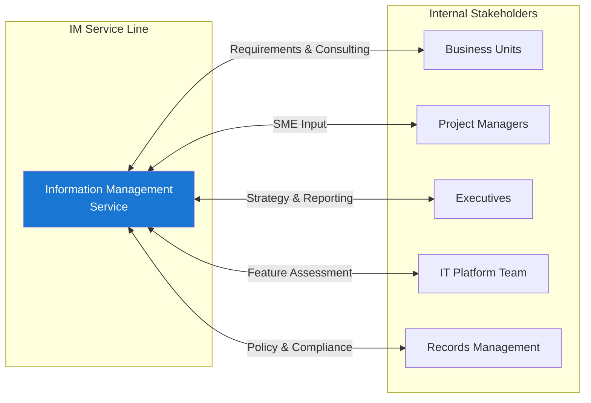

### External Relationships

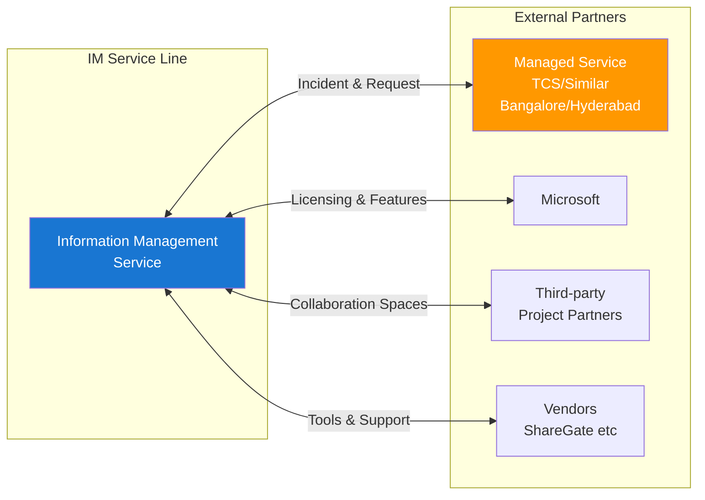

---

## 12. Role Requirements Summary (Position Being Recruited)

### Core Competencies Required

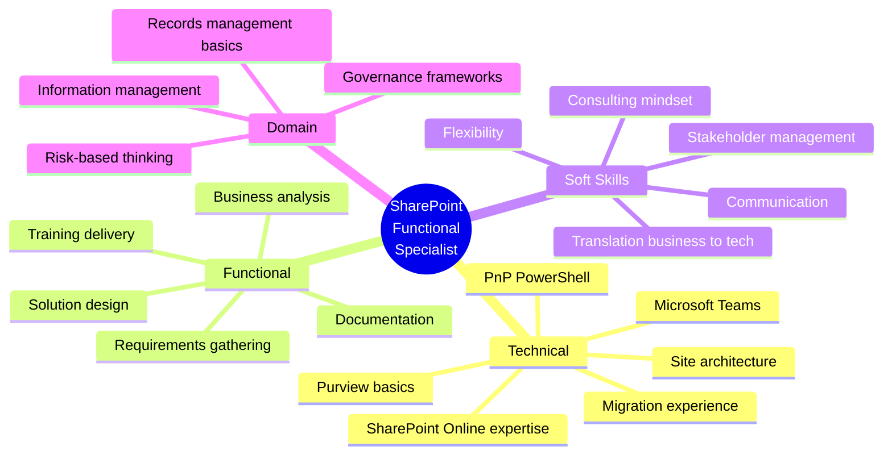

### Key Deliverables Expected

1. Functional consulting and guidance
2. Site builds and configurations
3. Migration planning and execution support
4. Requirements documentation for technical teams
5. Business training and adoption support
6. Contribution to governance and standards
7. Input to strategic initiatives (AI readiness, Purview)

---

## 13. Key Quotes & Insights

> "We're too big. The scale is too much for us to control everything... what our ethos is is really to understand where our risks are and then focus on those."

> "We have around 90 million files in SharePoint... we've now got a bit of a headache."

> "The issue with the disposal part is, especially after a long time, the people having to make the disposal decision don't have the context or confidence to make a decision. So you end up just keeping everything."

> "Technology is really 20% of the solution, it was taking the business, the executive, the stakeholders on the journey."

> "With AI, they're very heavy early adopters... needing to differentiate between the stuff we can trust and stuff we can't."

---

## 14. Organisational Context

| Attribute | Detail |
|-----------|--------|
| **Company** | Woodside Energy |
| **Industry** | Oil & Gas / Energy |
| **Location** | Perth, Western Australia |
| **Office** | Mia Yellagonga (Level 17 mentioned) |
| **Digital Maturity** | High - early AI/Copilot adopters |
| **IM Maturity** | Medium - strong adoption, governance gaps |
| **Scale** | ~90 million files, ~70,000 physical cartons |
| **Engagement Type** | 12-month full-time contract |
| **Start** | January 2025 target |

---

*Analysis generated from interview transcript dated 11 December 2024*
