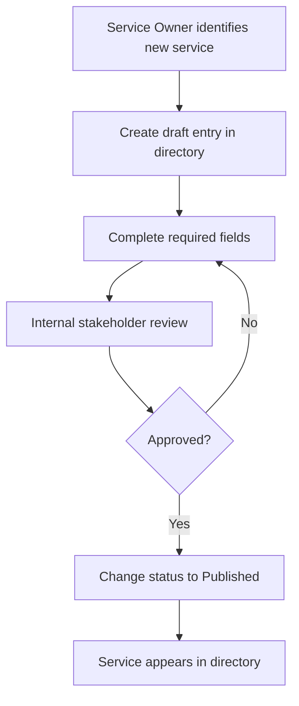
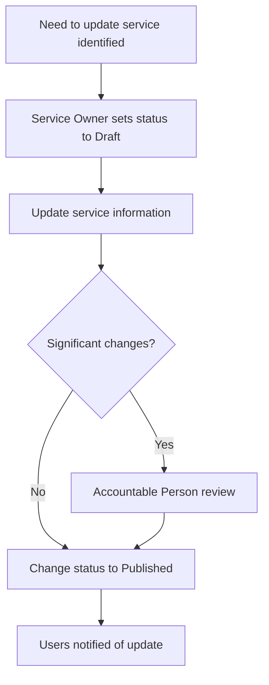
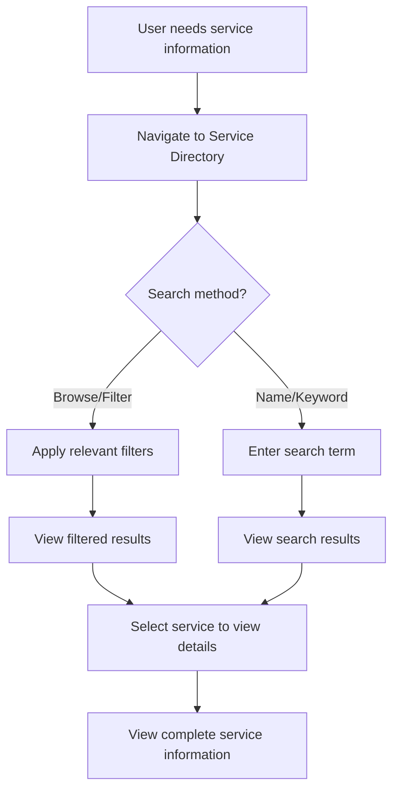
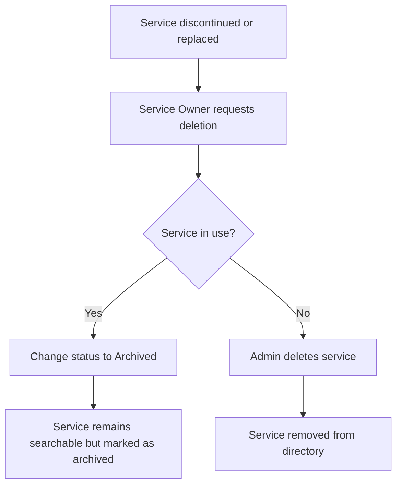

# Service Directory - Design Document

## 1. Introduction

### 1.1. Project Overview
The Service Directory is a centralized repository of information about services provided by IPC Health. It aims to provide staff with accurate, up-to-date information about all services offered by the organization, enabling better referrals, improved knowledge sharing, and more efficient service delivery.

### 1.2. Purpose
This document outlines the design specifications for the Service Directory, including data model, user stories, features, and implementation details. It serves as a blueprint for development and a reference for stakeholders.

### 1.3. Scope
The Service Directory will include both client-facing services (such as Audiology, Living Well Program, etc.) and business support services (such as IT). It will provide a standardized structure for service information while allowing for variations between service types.

## 2. User Stories and Requirements

This section outlines what the Service Directory needs to do, using the MoSCoW prioritization method (Must Have, Should Have, Could Have, Won't Have).

### 2.1. Must Have Requirements

1. **As a staff member**, I want to search for services by various parameters, so that I can find relevant services for clients or internal needs.
   
2. **As a staff member**, I want to see which services are available at specific locations, so that I can refer clients to services in their area.
   
3. **As a staff member**, I want to know expected timeframes for support, so that I can provide accurate information to clients about service availability.
   
4. **As a service leader**, I want to update information about my service easily, so that all staff have access to the most current information.
   
5. **As a staff member**, I want to see what a service can and cannot provide, so that I can make appropriate referrals.
   
6. **As a staff member**, I want to know eligibility criteria for services, so that I can determine if a client is eligible.

### 2.2. Should Have Requirements

7. **As a staff member**, I want to see contact information for services, so that I can direct queries appropriately.
   
8. **As a staff member**, I want to see what types of support are available (in-person, telehealth, etc.), so that I can inform clients of service delivery options.
   
9. **As a service leader**, I want to share information about group programs, so that staff can refer appropriate clients.
   
10. **As a staff member**, I want to filter services by tags (e.g., client groups), so that I can find relevant services based on specific needs.

### 2.3. Could Have Requirements

11. **As a staff member**, I want to access the Service Directory on my mobile device, so that I can find information when away from my desk.

12. **As a service leader**, I want to see usage statistics for my service information, so that I can understand how often it is being accessed.

13. **As a staff member**, I want to provide feedback on service information, so that it can be continually improved.

### 2.4. Won't Have Requirements

14. **Public access to the Service Directory** - The directory is for internal staff use only.

15. **Integration with external referral systems** - This functionality may be considered in future phases.

16. **Automated service matching for clients** - The system will provide information but not make automated service recommendations.

17. **Team and staff profiles** - These will be handled by the separate intranet project. The Service Directory is a standalone application focused only on service information.

18. **Automated data migration** - Data migration from existing sources will not be part of the initial implementation. All service information will be entered manually by Service Owners.
   - Source analysis and mapping of legacy data
   - Extract, transform, load processes
   - Migration validation and quality assurance
   
   *Note: A future phase may address data migration if needed.*

## 3. Data Model

### 3.1. Core Service Entity

The Service Directory will be implemented as a SharePoint list with the following fields, organized by logical groupings:

#### Basic Information
| Display Name | Internal Name | SharePoint Field Type | Description | Required |
|--------------|---------------|------------------------|-------------|----------|
| Title | Title | Single line of text | Name of the service | Yes |
| Service Goals | ServiceGoals | Multiple lines of text | One-sentence overview of purpose (Rich text) | Yes |
| Service Type | ServiceType | Choice | Client-facing or Business Support | Yes |
| Service Tags | ServiceTags | Managed Metadata | Taxonomy terms for categorization | No |
| Website URL | WebsiteURL | Hyperlink or Picture | Link to public website for the service | No |

#### Access Information
| Display Name | Internal Name | SharePoint Field Type | Description | Required |
|--------------|---------------|------------------------|-------------|----------|
| Referral Process | ReferralProcess | Multiple lines of text | How to refer clients to the service (Rich text) | Yes |
| Eligibility Criteria | EligibilityCriteria | Multiple lines of text | Who is eligible for the service (Rich text) | Yes |
| Service Contacts | ServiceContacts | Multiple lines of text | Contact information for the service (Rich text) | Yes |
| Service Locations | ServiceLocations | Managed Metadata | Physical locations where service is offered | Yes |
| Wait Times | WaitTimes | Multiple lines of text | Current waiting list information (Rich text) | No |
| Support Timeframes | SupportTimeframes | Multiple lines of text | Expected timeframes for BOH (Rich text) | No |
| Support Request Process | SupportRequestProcess | Multiple lines of text | How to request support for BOH (Rich text) | No |

#### Service Details
| Display Name | Internal Name | SharePoint Field Type | Description | Required |
|--------------|---------------|------------------------|-------------|----------|
| Service Offerings | ServiceOfferings | Multiple lines of text | What the service can help with (Rich text) | Yes |
| Service Exclusions | ServiceExclusions | Multiple lines of text | What the service doesn't provide (Rich text) | No |
| Support Types | SupportTypes | Choice (Multi-select) | In-person, telehealth, etc. | Yes |
| Service Delivery Details | ServiceDeliveryDetails | Multiple lines of text | What clients can expect (Rich text) | No |
| Fees and Costs | FeesAndCosts | Multiple lines of text | Fee structure information (Rich text) | No |

#### Additional Resources
| Display Name | Internal Name | SharePoint Field Type | Description | Required |
|--------------|---------------|------------------------|-------------|----------|
| FAQ | FAQ | Multiple lines of text | Frequently asked questions (Rich text) | No |
| Group Programs | GroupPrograms | Multiple lines of text | Available group programs (Rich text) | No |
| External Services | ExternalServices | Multiple lines of text | Related external services (Rich text) | No |
| Resources | Resources | Multiple lines of text | Links to resources (Rich text) | No |

#### Administration
| Display Name | Internal Name | SharePoint Field Type | Description | Required |
|--------------|---------------|------------------------|-------------|----------|
| Funding Source | FundingSource | Multiple lines of text | How the service is funded (Rich text) | No |
| Service Owner | ServiceOwner | Person or Group | Person responsible for the service and its content | Yes |
| Accountable Person | AccountablePerson | Person or Group | Person accountable for service delivery | Yes |
| Status | Status | Choice | Draft, Published, Archived | Yes |
| Last Review Date | LastReviewDate | Date and Time | Date when service information was last reviewed | Yes |
| Next Review Date | NextReviewDate | Date and Time | Scheduled date for next review | Yes |
| Modified | Modified | Date and Time (System) | Last modified timestamp | Auto |
| Modified By | Editor | Person or Group (System) | Person who last modified | Auto |
| Created | Created | Date and Time (System) | Creation timestamp | Auto |
| Created By | Author | Person or Group (System) | Person who created | Auto |

*Note: The system will use the built-in Modified and Modified By fields for tracking update dates and responsible persons, rather than maintaining separate date fields.*

### 3.2. Metadata and Taxonomy

A managed metadata term set will be created for tagging services with standardized terms. The taxonomy will include:

- **Service Categories**
  - Health Services
  - Community Services
  - Business Support
  - Administrative Support
  - IT Services
  - etc.

- **Client Groups**
  - Children (0-11)
  - Youth (12-25)
  - Adults
  - Seniors
  - Families
  - etc.

- **Specialties**
  - Mental Health
  - Physical Health
  - Sexual Health
  - Chronic Disease
  - etc.

- **Funding Sources**
  - CHSP
  - NDIS
  - Victorian Department of Health
  - Commonwealth
  - etc.

- **Locations**
  - Deer Park
  - St Albans
  - Hoppers Crossing
  - Wyndham Vale
  - Sunshine
  - Altona Meadows
  - Virtual/Online
  - At client's home
  - etc.

## 4. Functional Requirements

### 4.1. Service Directory Main Features

1. **Service Listing**
   - SharePoint list view showing all services
   - Custom grouped views by category, location, etc.
   - Summary cards with key information
   - Detailed view with all service information

2. **Search Functionality**
   - PnP search integration
   - Custom search refiners based on metadata
   - Saved search queries using SharePoint personal views
   - Keyword search across all text fields

3. **Service Management**
   - SharePoint list forms for adding/editing services
   - Version history tracking for all changes
   - Automated notifications for reviews and updates

4. **User Permissions**
   - SharePoint item-level permissions
   - Service Owners granted contributor access to their services
   - Small admin group granted edit access to all services
   - General staff given reader access

5. **Notifications**
   - Email notifications for content updates
   - Teams notifications for critical changes
   - Alert subscriptions for interested users

6. **Export Functions**
   - Export to Excel functionality

### 4.2. User Interface Requirements

1. **Main Directory View**
   - Modern SharePoint list view with custom formatting
   - Card view for visual presentation
   - Quick filters for common search parameters
   - Sorting options for various fields
   - *TBC - Mobile-responsive design for access on various devices*

2. **Service Detail View**
   - SharePoint display form with custom formatting
   - Related services and resources section

3. **Service Edit View**
   - SharePoint edit form with field validation
   - Guided input experience with help text
   - Rich text editors for formatted content
   - Image and document upload capabilities

4. **Search Interface**
   - PnP search results page with custom layout
   - Refiners panel for filtering results
   - Preview cards for search results

## 5. Key Processes

### 5.1. Create Service Process

### 5.2. Update Service Process

### 5.3. Read/Search Process

### 5.4. Delete/Archive Process

## 6. Technical Requirements

### 5.1. Platform Components

The Service Directory will leverage the following SharePoint components:

- **SharePoint List**: Primary data storage
- **SharePoint Views**: Customized ways to display service information
- **JSON Formatted Forms**: Custom form layouts for improved data entry experience
- **PnP Search Web Parts**: Enhanced search capabilities beyond standard SharePoint search
- **SharePoint Pages**: Custom pages for directory interface
- **Modern Web Parts**: Enhanced display of directory information

### 5.2. Integration Requirements

The Service Directory will integrate with:

- **Microsoft 365**: Authentication and user profiles
- **Microsoft Teams**: Notifications and embedded views
- **SharePoint Intranet**: Surfacing service information in other contexts
- **SharePoint Analytics**: Basic usage statistics and site analytics
- **Microsoft Forms**: Potential integration for feedback collection

*Note: Power BI advanced reporting and analytics is out of scope for the initial implementation.*

### 5.3. Data Migration Strategy

1. **Source Analysis**
   - Identify existing service information sources
   - Analyze data quality and completeness
   - Map legacy fields to new data model

2. **Migration Process**
   - Extract data from existing sources
   - Transform to match new data model
   - Load into SharePoint list
   - Validate data integrity

3. **Quality Assurance**
   - Verification of migrated data
   - Service owner review and sign-off
   - Gap analysis and follow-up

## 6. User Access and Security

### 7.1. SharePoint Permission Levels

- **Full Control**: Site administrators and IT
- **Design**: Service Directory administrators
- **Edit**: Service owners and delegates
- **Contribute**: Service content contributors
- **Read**: All staff

### 7.2. Item-Level Permissions

- Item-level permissions to restrict editing to service owners
- Break inheritance where necessary
- Permission inheritance for most items
- Use SharePoint groups for permission assignment

### 7.3. Security Considerations

- Regular permission audits
- Sensitive information protection
- Secure external sharing settings
- Compliance with organizational policies

## 7. Testing Strategy

### 7.1. Test Types

- **Unit Testing**: Individual components and fields
- **Integration Testing**: Connected features and workflows
- **User Acceptance Testing**: End-user validation
- **Performance Testing**: Response times and load
- **Security Testing**: Permission enforcement

### 7.2. Test Environments

- **Development**: Initial configuration and testing
- **Testing**: User acceptance testing
- **Production**: Final deployment

### 7.3. Test Cases

1. **Data Entry Testing**
   - Field validation
   - Required fields
   - Rich text formatting
   - Image and document uploads

2. **Search Testing**
   - Keyword searches
   - Metadata filtering
   - Result relevance
   - Search performance

3. **Workflow Testing**
   - Notifications
   - Approval processes
   - Scheduled reviews
   - Error handling

4. **Permission Testing**
   - Access control
   - Item-level permissions
   - View vs. edit capabilities
   - Admin functions

## 8. Maintenance and Support

### 9.1. Ongoing Maintenance

- Regular review of taxonomy terms
- Cleanup of orphaned items
- Performance monitoring
- Feature enhancements

### 9.2. Support Model

- Tier 1: Service desk for basic issues
- Tier 2: SharePoint administrators
- Tier 3: Development team for complex issues
- Self-service help resources

### 9.3. Documentation

- Admin guide
- User manual
- Training materials
- FAQ document

## 9. Risks and Mitigation

### 9.1. Identified Risks

1. **Data Quality**
   - Risk: Inconsistent or incomplete service information
   - Impact: High
   - Probability: Medium
   - Mitigation: Required fields, validation, review process

2. **User Adoption**
   - Risk: Staff resistance to new system
   - Impact: High
   - Probability: Medium
   - Mitigation: Comprehensive training, clear communication of benefits

3. **Performance**
   - Risk: Slow performance with large data volume
   - Impact: Medium
   - Probability: Low
   - Mitigation: Optimized queries, indexed columns, view thresholds

4. **Permission Complexity**
   - Risk: Difficult permission management
   - Impact: Medium
   - Probability: Medium
   - Mitigation: SharePoint groups, simplified permission model

### 9.2. Contingency Plans

1. **Data Quality Issues**
   - Regular data quality audits
   - Service Owner review process
   - Data cleanup procedures

2. **Performance Issues**
   - Column indexing
   - View optimization
   - Content archiving

3. **User Adoption Challenges**
   - Additional training sessions
   - Champions program
   - Feedback collection and implementation

## 10. Appendices

### 11.1. Glossary

- **BOH**: Back of House - Refers to business support services that support internal operations rather than directly serving clients
- **Content Type**: SharePoint template for list items
- **FOH**: Front of House - Client-facing services that directly serve external clients
- **JSON Formatted Form**: Custom form layout created using JSON code instead of Power Apps
- **Managed Metadata**: Controlled vocabulary in SharePoint
- **PnP**: Patterns and Practices - Community-driven open-source initiative providing enhanced components for SharePoint
- **Service Owner**: Person responsible for a service
- **SharePoint List**: Data storage container in SharePoint
- **Term Store**: Repository for managed metadata terms

### 11.2. Reference Documents

- Service Directory Excel prototype
- Meeting transcripts
- Service Directory Headings document
- SharePoint information architecture best practices
